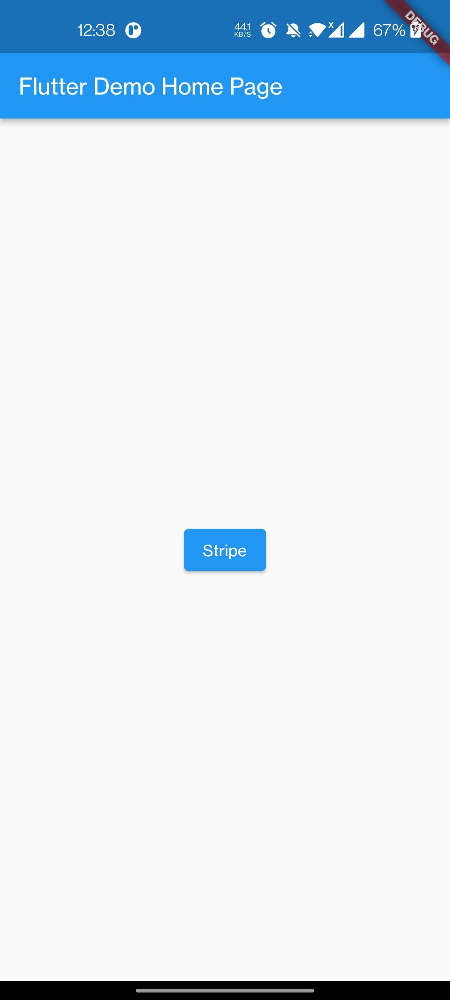
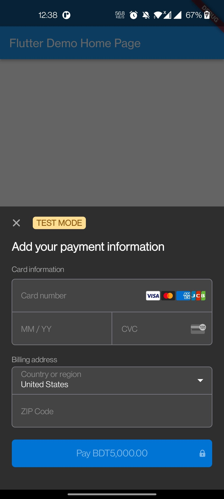

# Stripe Gateway Integration

In this project I have tried to integrate Stripe payment gateway in an easy way.

Lets Get Started....


## Table of Content

- Stripe Payment — Introduction

- Implementation — Setup Configuration

- Generate API Key

- Code Implement

- Conclusion

#### Strip Payment :


As a payment processor, Stripe allows business owners to accept payments from credit and debit cards and processes those payments.
Using Stripe, businesses can also accept payments from mobile wallets and buy now, pay later services. Stripe also supports payments in a variety of currencies.

#### Implementation — Setup Configuration :

#### Step 1: Add the dependencies
 
 Add [flutter_stripe](https://pub.dev/packages/flutter_stripe) dependencies to pubspec — yaml file.

 
    flutter_stripe: 

Run "flutter pub get" in terminal.

#### Step 2: requirements
There are few requirements for Android & iOS to work it on devices.

**Android:**

- Use Android 5.0 (API level 21) and above

  Make sure to make this change in android folder of your project.
   ```
   android {
    compileSdkVersion 32
        .....
    defaultConfig {
        // TODO: Specify your own unique Application ID (https://developer.android.com/studio/build/application-id.html).
        applicationId "com.example.flutterstripepaymentdemo"
        minSdkVersion 19
        targetSdkVersion 32
        versionCode flutterVersionCode.toInteger()
        versionName flutterVersionName
        multiDexEnabled true
        }
    }

- Use Kotlin version 1.5.0 and above. 
    ```
    ext.kotlin_version = '1.6.10'
 
- Using a descendant of Theme.AppCompat for your activity.
  **Make sure to use the same theme in values-night-> style.xml.**
   
    ```
    <?xml version="1.0" encoding="utf-8"?>
    <resources>
    <!-- Theme applied to the Android Window while the process is starting when the OS's Dark Mode setting is off -->
    <style name="LaunchTheme" parent="Theme.AppCompat.DayNight.NoActionBar">
        <!-- Show a splash screen on the activity. Automatically removed when
             Flutter draws its first frame -->
        <item name="android:windowBackground">@drawable/launch_background</item>
    </style>
    <!-- Theme applied to the Android Window as soon as the process has started.
         This theme determines the color of the Android Window while your
         Flutter UI initializes, as well as behind your Flutter UI while its
         running.

         This Theme is only used starting with V2 of Flutter's Android embedding. -->
    <style name="NormalTheme" parent="Theme.MaterialComponents">
        <item name="android:windowBackground">?android:colorBackground</item>
    </style>
    </resources>


- Using an up-to-date Android gradle build tools version.
  **Upgrade your gradle-wrapper.properties**

        distributionBase=GRADLE_USER_HOME
        distributionPath=wrapper/dists
        zipStoreBase=GRADLE_USER_HOME
        zipStorePath=wrapper/dists
        distributionUrl=https\://services.gradle.org/distributions/gradle-7.4-all.zip

- Using FlutterFragmentActivity instead of FlutterActivity in MainActivity.kt
    ```
    package com.example.stripe_gateway_implementation
    import io.flutter.embedding.android.FlutterFragmentActivity

    class MainActivity: FlutterFragmentActivity() {

    }
 

- Rebuild the app, as the above changes don't update with hot reload

These changes are needed because the Android Stripe SDK requires the use of the AppCompat theme for their UI components and the Support Fragment Manager for the Payment Sheets

If you are having troubles to make this package to work on Android, join this discussion to get some support

**iOS:**

Compatible with apps targeting iOS 12 or above.

#### Generate API Key :

[Get your test Stripe API keys](https://stripe.com/docs/keys)

Before that you must have to create an account and sign in to your [Dashboard](https://stripe.com/en-in) with suitable credentials.

- To get Test Card List you can visit [https://stripe.com/docs/testing](https://stripe.com/docs/testing)

#### Code Implement:

In the main.dart you must initialise the Publisher Key.

    
        void main() {
        Stripe.publishableKey = Constants.stripePublisherKey;
        runApp(const MyApp());
        }
The above code connects the application with your Stripe account, and therefore, all payments made by this app will be received in your account, which you can keep track of in the Stripe dashboard.

To make payment we must call API. Here I have used [dio ](https://pub.dev/packages/dio) but you can use any http client.

In the main.dart fie I have initialised a map and a Integer variable for price.
    
    Map<String, dynamic>? paymentIntentData;
    late int price = 0;

Then we will have a Future<void> method to make payment. Here we will pass the amount(String) 
and currecy(String). In the Map object **paymentIntentData** we will store the API response from **createPaymentIntent(String amount, String currency)** method

In the **createPaymentIntent** method we will call a POST API [https://api.stripe.com/v1/payment_intents](https://api.stripe.com/v1/payment_intents) and the queryParameters will be the 'amount', 'currency' and 'payment_method_types[]'.


     
      Future<void> makePayment(
      {required String amount, required String currency}) async {
        try {
        paymentIntentData = await createPaymentIntent(amount, currency);
            if (paymentIntentData != null) {
                await Stripe.instance.initPaymentSheet(
                    paymentSheetParameters: SetupPaymentSheetParameters(
                        // applePay: PaymentSheetApplePay(merchantCountryCode: 'US'),
                        // googlePay: PaymentSheetGooglePay(merchantCountryCode: 'US'),
                        merchantDisplayName: 'Shakiba',
                        customerId: paymentIntentData!['customer'],
                        paymentIntentClientSecret: paymentIntentData!['client_secret'],
                        customerEphemeralKeySecret: paymentIntentData!['ephemeralkey'],
                    ),
                );
                displayPaymentSheet();
            }
        } catch (e) {
        print(e.toString());
        }
    }

    //POST API call to get payment response
    createPaymentIntent(String amount, String currency) async {
        try {
        Response response = await DioBaseClient().postPayment(
            'https://api.stripe.com/v1/payment_intents',
            queryParameters: {
            "amount": calculateAmount(amount),
            'currency': currency,
            'payment_method_types[]': 'card'
            },
        );
        return response.data;
        } catch (e) {
        print(e.toString());
        rethrow;
        }
     }
    
    //To calculate the amount
    calculateAmount(String amount) {
        final a = (int.parse(amount)) * 100;
        return a.toString();
    }
  

After getting the response we will check either the **paymentIntentData** is null.
If it is not null we will initiate the stripe instance by following..
And after that we will call **displayPaymentSheet()** to show the Payment Sheet.

    void displayPaymentSheet() async {
        try {
        await Stripe.instance.presentPaymentSheet();
        snackbar('Payment Successful');
        } on Exception catch (e) {
        if (e is StripeException) {
            snackbar("Error from Stripe: ${e.error.localizedMessage}");
        } else {
            snackbar("Unforeseen error: ${e}");
        }
        } catch (e) {
        snackbar("exception: ${e}");
        }
    }

Now we will get a ElevatedButton Widget and call the **makePayment** method in the onPressed()
method of the button.
    
    ElevatedButton(
            style: ElevatedButton.styleFrom(
                primary: Colors.blue,
            ),
            onPressed: () {
                makePayment(amount: "5000", currency: "BDT");
            },
            child: const Text('Stripe'),
    ),

when you press the ElevatedButton, then the payment sheet will appear and you can test your payment flow by some [test card](https://stripe.com/docs/testing) information.
show a card pop up to save your card details. When you save your card, you then received your payment id and showed your current payment method.

## Screenshots
<p align="center">
<a href="url"></a>
<a href="url"></a>
</p>
